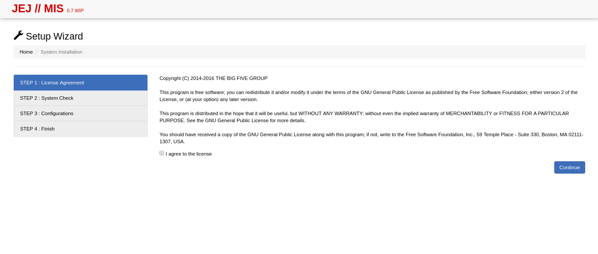
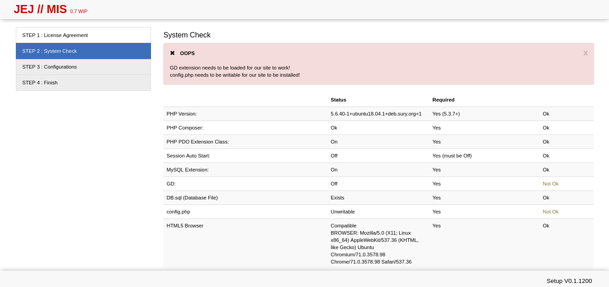

# From Static to Dynamic

*Adapting a new approach on Web Development*

The Web is expanding. From being basic & simple web pages from the 90’s, from dynamic web applications since the Social Media bubble, into today’s standards that being simple, light, but responsive. That’s why some low-key lazy developers like me, needed to learn new things, or get out of the box.

When *Friendster* launched, i was interested on web because of customizing your own profile page with HTML and Macromedia Flash. Then i started writing code with HTML as my playtime around 2009. Running on my old Sony laptop. I’d became in love with that markup language, because it’s very straightforward unlike other languages that needed to compile and check for errors in order to build the source code correctly.

*My old web page. Currently running at GitHub*

As i am exploring more, I've learned styling web pages using CSS, and manipulating elements thru JavaScript (although i hate JavaScript because of performance issues before).

Few years later, decided to learn Information Technology (instead of Engineering because i wanna know “business”) at college, learned more languages like Java, C#, PHP, and also HTML! At first, i was surprised about programming, so i found it sucks to learn or maybe they’ve pressuring us.

Following years, involved in various case studies and system analysis, my only solution stick to my mind was Web-based, since i sucked at developing programs like .Net, C# and Java. I became motivated when my colleagues believes my skill on Web Development, so i’d embraced it.

When my web-based project started, my advisers put some limitations due to their stereotypes, “Never use a Framework”. I’d kept asking it that why we should avoid using it? And it’s not like we’re spoon-feeding us with their own syntax codes, methodologies, etc. They don’t get the point of using a framework. Still, that was my challenge to me, so i made a new solution to this.

My aim is to develop an application with a micro-framework (meaning, the syntax codes are naked or the codes are also used on native language). First, to manage my project well, i’d started using Git, learned PHP, and forked two [micro-frameworks](https://github.com/panique/) (mini & php-login)

*After 3 years, tested on my new Linux server. It got errors!*

*Nice error message*

*Version 0 of my project*

*Version 0.7, migrating to new version back then*

[Download Technical Documentation here](https://drive.google.com/file/d/0B2-nE8ihxIifdU1xX3hoNVpvMVU/view?usp=sharing)

[Download Project’s User Manual here](https://drive.google.com/file/d/0B2-nE8ihxIifZXNpU1RzdzQ2T3M/view?usp=sharing)

After my almost 1-year project, I've learned a lot on Web Development, including front-end, UI/UX importance, Web Client approach, using Interface frameworks (such as Bootstrap, Foundation), and lastly, back-end development (Database Structure & Web Server)

After graduation, i am still stuck at PHP, and afraid to develop something else. So when i applied to a startup company few months ago, they’ve introduced me to develop with Ruby on Rails. I was overwhelmed how the heck is happening to my project before. I cannot found the source of magic (their basic principles, and the logic happening on every Ruby Gem) which is became my roadblock to familiarize. The worst is, i’d decided to leave the company due to workplace / location issues, so i have to apply another job, and going back again to PHP.

*Portfolio Page Version 1 while being laid off, LOL*

2 years later, after leaving to another company again, i’d realized that this is my chance to consider learning with different approach, and i don’t want to leaved behind on Web.

Today, I’ve discovered Mr. Michael Hartl, who made the [Ruby on Rails Tutorial Book](https://www.railstutorial.org/book). Starting again to avoid confusion with Ruby, i am so happy to learn new fresh air with another company. Right now i am still learning new things such as Stateless Web applications with GraphQL, Git Project Management with `git-flow`, Using vim as alternative text editor, etc.

) for front-end & GraphQL for back-end](images/1ku9SuvZsaK2tc9ldn6lEeg.png)*Portfoio Version 2.1 — Running with Nes.css (by [B.C.Rikko](https://twitter.com/bc_rikko)) for front-end & GraphQL for back-end*

I cannot express my fully conclusion at this article, but i want to make a point. The point is, it’s never too late to learn something new that is scary and difficult at first. In the end, you will get used to new things.

Hope you’ve reached here after reading my journey on Web Development and largest shift that i’d made in my life.