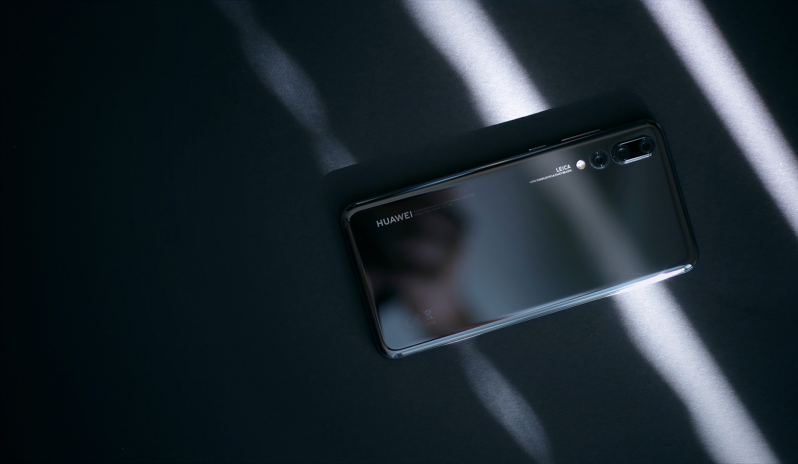
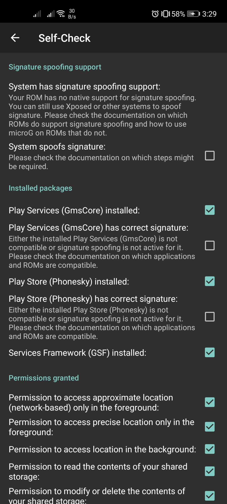

# Google alternatives for Huawei devices

**UPDATE:** It seems that the US was [not done yet](https://arstechnica.com/gadgets/2021/01/android-oem-xiaomi-lands-on-us-investment-ban-list/) in Trade Wars between the Chinese Government. So i changed my story title, to include the other Android devices that has no Google Services installed.

Last year, Huawei was banned/added to the US entity list for security concerns. That ban badly hurt the company because Google and other US companies had no other choice to join the bandwagon (pun unintended), so i already realized how large the impact could occur just by preventing using an ecosystem like Google, and how can I use my Huawei device for online things?

Now I will stop discussing more the political issues because this year I have bought a No-Google installed Huawei device and I have found some workarounds.

## The Google-less Android experience

I have an Huawei device named Nova 7 SE (with 5G chipset), which is being released after the US Ban. The initial setup of my Huawei was just seamless as the normal Android ones did, or even my old ones, just no Google setup occurred, it’s just weird.
> I have experience of using a Huawei device before, it was named Huawei GR3 2017, which has Google installed apps, on the top of their Android-based system called EMUI.

Fortunately, i have been on their own ecosystem before so i restored back everything i have from their cloud storage service called Huawei Cloud, which is really similar to the iCloud.

## Thoughts about side-loading Google apps

I am already aware that is possible to side-load Google Services by using various methods except rooting, however, by the time i bought my device, i already updated the firmware (Current workaround was working on EMUI 10.1.13x, while my device is already in 10.1.195), so it's already impossible to make it work.
> Rooting/Unlocking the device is not the best option to my problem, because beside the warranty, i usually maintain the eligibility of my devices for 1–2 years.

## What apps do i exactly need?

This situation make me rethink about Google and it's services, which is also make me realize that clinging to one single ecosystem is a bad thing, so i am exploring other apps & services that Google doesn’t have.

### Looking for the other Play Store

As the AppGallery provides the essential apps that i want, some apps still doesn’t support this different ecosystem, so i was looking for other alternatives.

Back in 2012, Google released the Android Market (Google Play) API for developers, then few years later, some people make the other Play Store, backed with open source initiatives.

* First is the Yalp Store. It was my first Play Store alternative that I've been heard before. Although i never used this, it was a great attempt to be able to side-loaded without modifying your system.

* Second is the Aurora Store which is a forked Yalp Store with a bunch of features. Unlike Yalp, this one has the updated UI, spoofing app availability by device or location, blacklist feature, login with Google (for paid apps & games), etc. I am currently using this as a Play Store alternative beside AppGallery.

## Replacing the essentials

Now i can install my current apps, but it wouldn’t run Google apps, of course. So can i replace them? Fortunately, i am not the only one who doesn’t cling to Google very much. And i found several options that are easy to try.

### Native app alternatives

* For **Gmail**, I use **Microsoft Outlook
   *I’ve used Huawei’s Email client for a month, and I found something’s missing on the user experience level.*

* For **Google Chrome**, I use **Mozilla Firefox** or **Microsoft Edge**
   *I’ve tried Huawei Browser (which is a Chromium-based browser), but i wanted to sync my bookmarks so that is not my best option.*

* For **Google Docs/Sheets/Slides**, I use **Microsoft Office**
   *It has Google Drive support*

* Speaking of **Google Drive **support, I use **FX File Manager**
   *I currently used FX File Manager with a separate premium key installed. If you don’t have a Google Drive, I suggest to use MEGA or Huawei’s Drive service, and it’s affordable.*

* For **YouTube** (including YT Music), I use **[YouTube Vanced](https://github.com/YTVanced/VancedManager)**
   *DISCLAIMER: I do not endorse this for piracy or copyright infringement though, so use this at your own risk.*

* For **Google Photos**, I use **Photo Tool **(available only on Play Store) or **Huawei’s** **Cloud** service

* For **Google Maps**, I use the following: their [PWA version](https://www.google.com/maps) or another app called **HERE WeGo** (Has navigation & can navigate offline)
   *The Huawei map app is fine but the map is kinda outdated since it never uses their data from Google at all*

* For password management (including auto-filling it), I use **SafeInCloud.**
   *You can use **RememBear** or **Firefox Lockwise.***

* For Two-factor Authentication, I use **Authy**
   *Just ignore the Google Play Services warning message, and it would work just fine.*

### Progressive Web Apps with Google

Unable to use Google applications such as Meet, Classroom, etc.? Well, Google made some amazing but for different cause. The web is being overruled lately by huge number of applications that can be available on iOS & Android. But, they consider the following:

* The market on developing countries and users that have low to mid-end devices with technical limitations (e.g: Low capacity of RAM & Internal Storage, Slower Internet connection, etc.).

* For Apple, when Steve Jobs hates the resource-hungry Flash Player feature on mobile devices, ever since the first iPhone.

* Lastly, the HTML5 technology already exists back in 2014

So in 2018, they created the new type of software called [“Progressive Web Apps”](https://web.dev/progressive-web-apps). PWA or Progressive Web Apps is heavily relies on a Web Browser since they have the technologies needed such as Graphics, Sound, Microphone, Camera, and even Gyro sensors, etc. In this article though, i found some alternatives for the apps that are exclusive to Google:

* Google Search Engine (google.com duh!)

* [Google Maps](https://google.com/maps) (No navigation though)

* [Google Meet](https://apps.google.com/meet)

* [Google Classroom](https://classroom.google.com/h)

* [Google Keep](https://keep.google.com)

* [YouTube](https://m.youtube.com)

* Instant Apps on AppGallery

* and more! I haven’t tried other stuff

I’d recommend to search these first on AppGallery & Petal Search (if you have one), before trying on browser itself.

### Using microG as a Google Mobile/Play Services alternative

Before looking up for app alternatives, the apps on the Play Store are now mostly relied on a sophisticated service called Google Play Services or Google Mobile Services which is being used for Google APIs, maps, authentication and analytics, including their Firebase which is also being used for crash/error reporting and push notifications. With this caveat, there’s a very high possibility of being unstable or crashes on your apps. So here’s a workaround.

microG is a FOSS version and re-implementation of Google Mobile Services. This is required to side-load onto the system partition of your device, but in my case, i install locally on my user storage of my device.

> Since i installed microG on my user storage, it will usually break except push notifications and maps (partially), which is already fine for me. And of course my device has no native support for signature spoofing which is only works on custom ROMs or any but side-loaded libraries on system partition.
> I have my own fork of microG because i wanted to spoof the device properties in order to work login & push notifications correctly.
> [https://github.com/jcchikikomori/GmsCoreHuawei](https://github.com/jcchikikomori/GmsCoreHuawei)

### Using Dual Space & GSpace

Using contained Android instance in a single real machine is much better than sideloading microG. This method is one that i use for some apps that requires Google Services such as Location and others. It has Google, and will work many apps including Meet & Classroom, *except Games that requires Google and Google Suite apps such as Drive, Keep, etc.*

You can find **GSpace** in AppGallery

### Using Virtual Machines / Emulators

Android emulation already exists many years ago, but running from your device is still mind-blowing, thanks to the power of the ARM architecture. One of the emulators that i use is VMOS Pro. You can try it via [website](https://www.vmos.com), but i prefer this [one that has complete instructions](https://www.andnixsh.com/2020/09/vmos-pro-custom-roms-android-511-and.html).

## Conclusion

Having an Android device that has no Google dependencies is not the end of the world. Also they are many things that still you can do beside Google.

## References

* [https://consumer.huawei.com/ae-en/community/details/Youtube,-Google-Photos,-drive,-contacts-alternatives/topicId_46882/](https://consumer.huawei.com/ae-en/community/details/Youtube,-Google-Photos,-drive,-contacts-alternatives/topicId_46882/)

* [https://microg.org/](https://microg.org/)

* [https://www.xda-developers.com/appgallery-huawei-alternative-google-play-store-android/](https://www.xda-developers.com/appgallery-huawei-alternative-google-play-store-android/)

* [https://en.wikipedia.org/wiki/Thoughts_on_Flash](https://en.wikipedia.org/wiki/Thoughts_on_Flash)